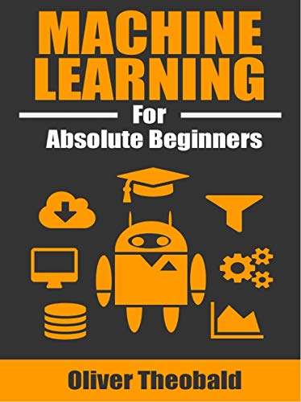

[Amazon: Machine Learning For Absolute Beginners](https://www.amazon.com/Machine-Learning-Absolute-Beginners-Introduction-ebook/dp/B06VXKBLNG)

As the title says, this book is a good read for beginners. I read it to brush up on the basics and it was a pretty fluid read. The key takeaways for me were the differences between the closely related fields like Data Science, Machine Learning and Artificial Intelligence; pros and cons of basic Machine Learning algorithms like Linear/Logistic regression, classification algorithms and a brief overview of Neural Networks. The book hardly goes into the details of how those algorithms work but provides you with enough knowledge to start using them in your project with the help of libraries like scikit-learn and numpy. It also includes a "Hello World" project of ML to experience how it actually works and to get you started. Overall it is an afternoon well spent with an average reading time of around 3 hours but depends on how quickly you are able to turn pages. 
